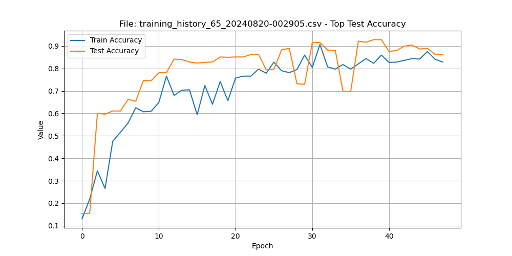

# Master's Thesis: OCR and Neural Networks

**Title:** Analysis of Letter Recognition Using Artificial Neural Networks

**Objective:** 
To recognize letters using Artificial Neural Networks (ANN):
1. Letters created on 28x28 pixel matrices - used for the test set.
2. Letters from the dataset [HuggingFace Letter Recognition](https://huggingface.co/datasets/pittawat/letter_recognition) - used for the training set.

## Table of Contents

1. [Introduction](#introduction)
2. [Business Justification](#business-justification)
3. [Research Hypothesis](#research-hypothesis)
4. [Technologies Used](#technologies-used)
5. [Algorithms/Models](#algorithmsmodels)
6. [Data Download](#data-download)
7. [Running Experiments](#running-experiments)
8. [Monitoring Results](#monitoring-results)
9. [Experiment Results](#experiment-results)
10. [Contributing](#contributing)
11. [License](#license)
12. [Acknowledgements](#acknowledgements)

## Introduction

My master's thesis focuses on pattern recognition of characters using artificial neural networks (ANN). The goal is to develop and train ANN models capable of identifying various characters.

## Business Justification

Automating text recognition has broad applications across different industries. For example, in banking, it can automate check data entry; in medicine, digitize handwritten prescriptions; and in logistics, streamline address reading on packages.

## Research Hypothesis

The hypothesis to be verified is: "Artificial neural networks can effectively recognize character patterns and handwriting of different matrix sizes and writing styles, providing results comparable or superior to traditional OCR methods."

## Technologies Used

- **Programming Language:** Python
- **Image Processing Libraries:** OpenCV
- **Deep Learning Frameworks:** TensorFlow

## Algorithms/Models

The main focus is on designing, implementing, and training neural networks using various architectures, such as Convolutional Neural Networks (CNN), which are particularly useful for visual pattern recognition.

## Data Download

To download the data, run:

```bash
python download_data.py
```

Running Experiments
You can run experiments using the run_experiments.py script. Example:

python run_experiments.py --experiment_id 0 --epochs 10
After running the script, TensorBoard will automatically start and save logs in the directory results/tensorboard_logs_{experiment_id}_{timestamp}.

Monitoring Results
To monitor experiment results in real-time, open a terminal and run:

tensorboard --logdir=results
Then open your browser and go to http://localhost:6006/.

### **Summary of Experiments**

### **Best Model and Results**

The best model from the conducted experiments was **CNN4**, achieving the highest validation accuracy of **91.83%** and training accuracy of **94.79%**, with corresponding losses of **0.315 for validation** and **0.177 for training**.

#### **Key Aspects of CNN4 Architecture**

**Layer Architecture**
- **Three Convolutional Blocks:** Each block features filters with increasing sizes (32, 64, 128) and kernel sizes of 3x3. This setup is optimal for capturing details in low-resolution images (28x28). Early layers detect basic features like edges, while later layers identify more complex structures and abstract patterns, enabling accurate recognition of letters and digits. Activation function used: **ReLU**.
- **Batch Normalization:** Applied after each convolutional layer to stabilize the learning process by reducing the effect of gradient fluctuations. This leads to faster learning and better generalization, resulting in improved validation performance.
- **MaxPooling:** Reduces the feature map size, decreasing the number of parameters and speeding up computations. CNN4 uses two MaxPooling layers, preserving prominent image features essential for classification.
- **Flatten:** Converts feature maps into a one-dimensional vector to prepare the data for classification.
- **Dense Layer (128 units, ReLU):** Processes complex image features extracted by the convolutional layers. This layer acts as the classifier by analyzing the feature patterns.

**Input Layer:**
- **Definition of Dimensions:** The input layer is defined by `input_shape=INPUT_SHAPE`, suitable for images of size 28x28 with a single channel (grayscale). The dimensions are specified as `(28, 28, 1)`.

**Output Layer:**
- The **Softmax** activation function generates probabilities for each class, completing the classification process.

---

#### **CNN4 Workflow**
1. Convolutional layers process the image, extracting features, which are normalized via batch normalization and reduced by max pooling.
2. After the final convolutional layer, the Flatten layer converts the 3D feature maps into a 1D vector.
3. The Dense layer analyzes the feature combinations and passes the results to the output layer.
4. The output layer generates class probabilities using Softmax activation.

---

#### **Detailed Layer Architecture**
- **Convolutional Layers:**
  - `Conv2D(32) → BatchNormalization → ReLU → MaxPooling`
  - `Conv2D(64) → BatchNormalization → ReLU → MaxPooling`
  - `Conv2D(128) → ReLU → Flatten`
- **Dense Layers:**
  - A Dense layer with 128 units and ReLU activation processes complex patterns before passing the result to the final output layer.
- **Output Layer:**
  - Softmax activation provides class probabilities for classification.

---

#### **Optimization and Regularization**
- **Optimizer:** Adam with a learning rate of **0.0001** ensures effective weight updates, supporting training stability and speed.
- **Dropout:** Not applied in CNN4. The combination of batch normalization and data augmentation effectively prevents overfitting, making dropout unnecessary. Adding dropout might have reduced the model's ability to learn.
- **Regularization:** 
  - Batch normalization stabilizes training and reduces overfitting.
  - Data augmentation enhances model generalization by increasing the variability of training samples.

---

#### **ReLU Activation Effectiveness**
- Reduces computational complexity and accelerates training.
- Introduces sparsity, focusing on key features.
- Works well for image classification tasks with distinct patterns.
- Synergizes with batch normalization, improving model stability and convergence.

---

#### **Data Augmentation Techniques**
In Experiment 57, several augmentation strategies were applied:
- **Zoom:** 15% scaling trains the model to handle variations in object size.
- **Rotation:** 4° rotation helps in recognizing characters with varying orientations.
- **Width and Height Shift:** Horizontal and vertical shifts (15%) improve generalization by teaching positional variability.
- **Shear Range:** 15% perspective shifts increase flexibility in recognizing objects from different angles.

Augmentation enhances the model's robustness to data variability and improves performance on the validation set.

---

#### **Why CNN4 Achieved the Best Results**
1. **Batch Normalization and Augmentation:** Struck an optimal balance between learning ability and generalization.
2. **Computational Efficiency:** MaxPooling reduces the parameter count, accelerating training and helping the model focus on critical features like edges and contours, crucial for digit and letter classification.
3. **Balanced Regularization:** The absence of dropout was advantageous as augmentation and batch normalization sufficiently prevented overfitting. Adding dropout might have hindered the model's generalization capability by over-regularizing.

The CNN4 model represents a well-balanced architecture, leveraging effective feature extraction, efficient regularization, and advanced optimization to achieve superior performance.


#### **DNN Experiments**
- **Experiment 0:**
  - **Test Accuracy:** ~25%
  - **Training Behavior:** Model learns but overfits significantly.
  - **Early Stopping:** Triggered at epoch 34.
  - **Conclusion:** Overfitting is present.

- **Experiment 1:**
  - **Test Accuracy:** ~19%
  - **Training Behavior:** Overfitting observed as early as epoch 2-3.
  - **Loss Trend:** Systematic divergence between training and testing loss.
  - **Early Stopping:** Triggered at epoch 8.
  - **Conclusion:** Model overfits quickly and doesn't generalize well.

---

#### **CNN Experiments**
- **Experiment 2:**
  - **Test Accuracy:** ~37%
  - **Train Accuracy:** ~74.5%
  - **Training Behavior:** Overfitting observed.
  - **Loss Trend:** Divergence between training and testing loss starts early.
  - **Early Stopping:** Triggered at epoch 8.
  - **Conclusion:** High overfitting but moderate test accuracy.

- **Experiment 3:**
  - **Test Accuracy:** ~39%
  - **Train Accuracy:** ~80.8%
  - **Training Behavior:** Overfitting observed.
  - **Loss Trend:** Clear divergence between training and testing loss.
  - **Conclusion:** Overfitting persists but test accuracy improves slightly.

- **Experiment 4:**
  - **Test Accuracy:** ~20.9%
  - **Train Accuracy:** ~25.4%
  - **Training Behavior:** No overfitting but significant underfitting.
  - **Loss Trend:** Oscillation in training loss.
  - **Data Augmentation:** The test dataset is easier to learn due to lack of augmentation, leading to slightly higher test accuracy than train accuracy.
  - **Conclusion:** Model struggles with augmented training data, leading to underfitting.

- **Experiment 5:**
  - **Test Accuracy:** ~25.88%
  - **Train Accuracy:** ~23.5%
  - **Training Behavior:** Loss oscillation observed on training data.
  - **Data Augmentation:** Similar effect as in Experiment 4, where test accuracy exceeds train accuracy.
  - **Conclusion:** Model faces difficulty learning from augmented training data.

- **Experiment 6:**
  - **Test Accuracy:** ~23.5%
  - **Train Accuracy:** ~40.5%
  - **Training Behavior:** Loss oscillation observed.
  - **Early Stopping:** Triggered at epoch 40.
  - **Conclusion:** Overfitting is reduced compared to earlier experiments, but generalization remains poor.

- **Experiment 7:**
  - **Test Accuracy:** Pending
  - **Train Accuracy:** Pending
  - **Training Behavior:** Similar oscillation in training loss anticipated.
  - **Data Augmentation:** Likely to result in a test accuracy higher than train accuracy due to easier-to-learn validation set.

- **Experiment 8:**
  - **Epoch 11:**
    - **Accuracy:** 3.67%
    - **Loss:** 3.2597
    - **Validation Accuracy:** 3.85%
    - **Validation Loss:** 3.2581
  - **Conclusion:** Kernel size of 5x5 is likely too large, leading to poor learning.

- **Experiment 9:**
  - **Configuration:** Runs for 350 epochs.
  - **Outcome:** Pending results.

-

License
This project is licensed under the MIT License.

Acknowledgements
Special thanks to the creators of the datasets and the open-source libraries used in this project.

# Praca Magisterska

Temat pracy : 
"Analiza ropoznawania liter za pomocą sztucznych sieci neuronowych" 

Celem pracy będzie rozpoznanie za pomocą Sztucznej sieci Neuronowej: 
1)	liter utworzonych na matrycach 28 pikseli x 28 pikseli -  są wykorzystawane do zbioru testowego 
2)	liter z bazy danych https://huggingface.co/datasets/pittawat/letter_recognition - są wykorzystywane do zbioru treningowego 


1. **Opis problemu**:
Moja praca magisterska koncentruje się na rozpoznawaniu wzorców znaków przy użyciu sztucznych sieci neuronowych (SSN). Zajmuję się opracowaniem i treningiem modeli SSN zdolnych do identyfikacji liter utworzonych na matrycach o różnych rozmiarach, a także rozpoznawaniem pisma odręcznego. Problemem biznesowym, który ten model ma rozwiązać, jest potrzeba efektywnego i automatycznego przetwarzania informacji wizualnych na dane cyfrowe, które mogą być łatwo przeszukiwane i analizowane przez systemy komputerowe.

2. **Uzasadnienie biznesowe**:
Automatyzacja procesu rozpoznawania tekstu ma szerokie zastosowanie w różnych branżach. Na przykład, w bankowości można automatyzować procesy wprowadzania danych czeków, w medycynie - cyfryzować ręcznie zapisane recepty, a w logistyce - usprawniać odczytywanie adresów na paczkach. 

3. **Hipoteza badawcza**:
Hipoteza, którą zamierzam zweryfikować, brzmi: "Sztuczne sieci neuronowe są w stanie efektywnie rozpoznać wzorce znaków oraz pismo odręczne w różnych rozmiarach matrycy i różnym stylu pisma, dostarczając wyniki porównywalne lub lepsze niż tradycyjne metody OCR".

4. **Wykorzystane technologie**:
W pracy wykorzystuję język programowania Python, biblioteki do przetwarzania obrazów takie jak OpenCV oraz frameworki do głębokiego uczenia się jak TensorFlow, które są idealne do projektowania, trenowania i weryfikacji modeli SSN.

5. **Algorytmy/ modele**:
Głównym elementem mojej pracy jest projektowanie, implementacja i trening sieci neuronowych z użyciem różnorodnych architektur, takich jak konwolucyjne sieci neuronowe (CNN), które są szczególnie przydatne w rozpoznawaniu wzorców wizualnych.


# Download data

```bash
python download_data.py
```

# Uruchamianie Eksperymentów
Eksperymenty można uruchomić za pomocą skryptu run_experiments.py. Przykładowe uruchomienie eksperymentu:

python run_experiments.py --experiment_id 0 --epochs 10
Po uruchomieniu skryptu, TensorBoard automatycznie uruchomi się i zapisze logi z treningu modelu w katalogu
results/tensorboard_logs_{experiment_id}_{timestamp}.

Monitorowanie Wyników z TensorBoard
Uruchomienie TensorBoard
Aby monitorować wyniki eksperymentów w czasie rzeczywistym, otwórz terminal i uruchom TensorBoard:

tensorboard --logdir=results
Po uruchomieniu TensorBoard, otwórz przeglądarkę internetową i przejdź do adresu http://localhost:6006/. Tam będziesz
mógł zobaczyć wykresy i wizualizacje wyników, takie jak:

# Run Experiments
# DNN

- [x] Experiment 0: `python run_experiments.py --experiment_id 0 --epochs 50`
  - Conclusions: Test Acc: +-25%, uczy się ale jest overfitting i na 34 epoce EarlyStopping
- [x] Experiment 1: `python run_experiments.py --experiment_id 1 --epochs 50`
  - Conlusions: Test Acc: +- 19%,
  - Overtfitting na 2/3 epoce
  - Wartość funkcji straty (loss) zaczyna się systemtycznie oddalac mięzyzbiorem testowym,a treningowym
  - na 8 epoce EarlyStopping

# CNN

- [X] Experiment 2: `python run_experiments.py --experiment_id 2 --epochs 50`
  - Test Acc: +- 37 % Train Acc +- 74,5 %
    -overfitting : True
  - Wartość funkcji straty (loss) zaczyna się systemtycznie oddalac mięzyzbiorem testowym,a treningowym
  - na 8 epoce EarlyStopping
- [x] Experiment 3: `python run_experiments.py --experiment_id 3 --epochs 50`
  - Test Acc: 39 %
  - Train Acc: 80,8 %
  - overfitting: True
  - Wartość funkcji straty (loss) zaczyna się systemtycznie oddalac mięzyzbiorem testowym,a treningowym

- [x] Experiment 4: `python run_experiments.py --experiment_id 4 --epochs 50`
  - Test Acc: 20,9%
  - Train Acc: 25,4%
  - overfitting: False
  - underfitting: True
  - Loss: Cykliczne zmiany na zbiorze treningowym osycalacja,
  - W związku z zastosowaniem augumentacji danych, wynik na zbiorze testowym jest wyższy, niż na treningowym.
  - Wynika to z tego, że z powodu augumentacji danych, jest aktywna tylko w zbiorze trenigowym, powoduje dodawnie
    większej ilości danych,
  - przez co jest trudniejsze nauczenie się tak powiększoneg zbioru
  - augumentacja nie jest aktywna w trakcie walidacji. Niezaugumentowane zbiór jest łatwiejszy do nauczenia,
  -
- [x] Experiment 5: `python run_experiments.py --experiment_id 5 --epochs 50`
  - Test Acc: 25,88%
  - Train Acc: 23,5%
  - overfitting:
  - underfitting:
  - Loss: np. Cykliczne zmiany na zbiorze treningowym osycalacja,
  - W związku z zastosowaniem augumentacji danych, wynik na zbiorze testowym jest wyższy, niż na treningowym.
  - Wynika to z tego, że z powodu augumentacji danych, jest aktywna tylko w zbiorze trenigowym, powoduje dodawnie
    większej ilości danych,
  - przez co jest trudniejsze nauczenie się tak powiększoneg zbioru
  - augumentacja nie jest aktywna w trakcie walidacji. Niezaugumentowane zbiór jest łatwiejszy do nauczenia,
- [x] Experiment 6:`python run_experiments.py --experiment_id 6 --epochs 50`
  - Train Acc:40,5%
  - Test Acc: 23,5%
  - Loss: Cykliczne zmiany na zbiorze treningowym osycalacja,
  - 40 epok EarlyStopping
- `python run_experiments.py --experiment_id 7 --epochs 50`
  - Test Acc:
    - Train Acc:
    - overfitting:
    - underfitting:
    - dropout:
    - Loss: np. Cykliczne zmiany na zbiorze treningowym osycalacja,
    - W związku z zastosowaniem augumentacji danych, wynik na zbiorze testowym jest wyższy, niż na treningowym.
    - Wynika to z tego, że z powodu augumentacji danych, jest aktywna tylko w zbiorze trenigowym, powoduje dodawnie
      większej ilości danych,
    - przez co jest trudniejsze nauczenie się tak powiększoneg zbioru
    - augumentacja nie jest aktywna w trakcie walidacji. Niezaugumentowane zbiór jest łatwiejszy do nauczenia,
- `python run_experiments.py --experiment_id 8 --epochs 50`
- Epoch 11/50
- accuracy: 0.0367 - loss: 3.2597 - val_accuracy: 0.0385 - val_loss: 3.2581
- Najprawdopodobniej kernel 5x5 jest za duży, sieć się nie uczy
- `python run_experiments.py --experiment_id 9 --epochs 350`

Best result



 Todo
-słów z bazy danych IAM Handwriting Database https://fki.tic.heia-fr.ch/databases/iam-handwriting-database
- train models
  - config_experiment
- visualization/reporting
script_train -> (test_results) CSV -> Visulaization.ipynb -> JPG -> Report.md keras.callback.CSVLogger CSV:
```bash
python -m run_experiment --id 2
```


https://keras.io/api/applications/


